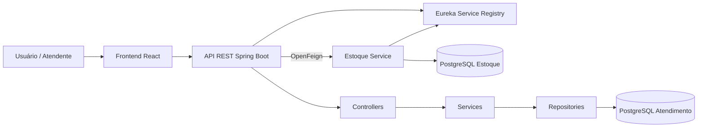
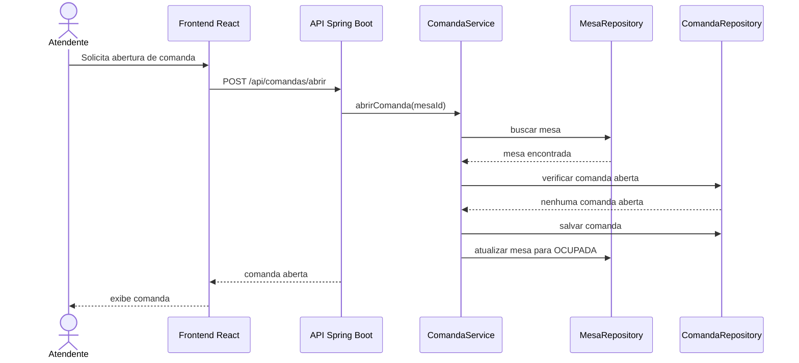
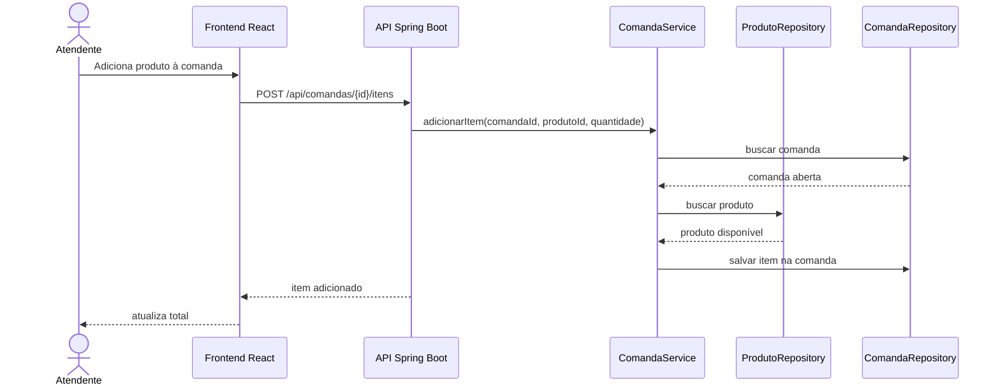

# Arquitetura - Pé Sujo

## Objetivo

O Pé Sujo é um sistema acadêmico de comanda aberta para um boteco brasileiro tradicional. O atendimento permanece em um backend Spring Boot e o estoque tem serviço e banco próprios.

## Contexto

O atendente visualiza as mesas do salão, abre uma comanda para uma mesa livre, adiciona produtos consumidos, acompanha o total e fecha a conta. Ao fechar a comanda, a mesa volta a ficar livre.

## Funcionalidades Implementadas

- Cadastro, listagem, consulta, atualização e remoção de mesas.
- Alteração de status de mesa.
- Cadastro, listagem, consulta, atualização e remoção de produtos.
- Marcação de produto como disponível ou indisponível.
- Abertura, listagem, consulta, cancelamento e fechamento de comandas.
- Adição e remoção de itens da comanda.
- Cálculo de total da comanda.
- Interface React consumindo a API REST.

## Arquitetura em Camadas

O backend está em `backend/` e usa uma divisão por domínio, mantendo o monólito simples:

- `controller`: recebe requisições HTTP e retorna respostas REST.
- `service`: concentra regras de negócio.
- `repository`: acesso a dados com Spring Data JPA.
- `domain`: entidades e enums de negócio.
- `dto`: objetos de entrada e saída da API.
- `shared.exception`: exceções e tratamento global.
- `shared.config`: CORS e dados iniciais.

O frontend está em `frontend/` e usa React com Vite:

- `api`: cliente HTTP.
- `services`: funções de consumo da API.
- `components`: componentes reutilizáveis.
- `pages`: tela principal de atendimento.

## Microsserviço de Estoque

`estoque-service/` é responsável exclusivamente pelos saldos de produtos. Seu banco PostgreSQL não possui chaves estrangeiras para o banco do atendimento: a baixa usa `produtoId` por HTTP e o estorno usa eventos RabbitMQ.

`service-registry/` executa o Eureka. O `backend/` e o `estoque-service/` registram-se nele; o backend localiza `estoque-service` pelo nome usando Spring Cloud OpenFeign. O front-end continua consumindo apenas o backend.

Ao adicionar item a uma comanda, o backend reserva o saldo de forma síncrona. Ao remover item ou cancelar comanda, grava um evento em outbox e o estoque estorna de forma assíncrona. Fechar a conta mantém a baixa. Saldo insuficiente na adição retorna `409`; serviço de estoque indisponível na adição retorna `503`.

O estorno usa outbox transacional, confirmação do broker e deduplicação no estoque. Não há transação distribuída entre a baixa síncrona e a comanda. O contrato, diagramas e recuperação de falhas estão em [eventos.md](eventos.md).

## Tecnologias

- Java 21.
- Spring Boot 4.
- Spring Web MVC.
- Spring Data JPA.
- Bean Validation.
- PostgreSQL 17, Flyway e Hibernate Envers.
- Maven.
- React.
- Vite.
- Vitest.
- CSS simples.

## DDD Simples

Domínio principal: Gestão de Atendimento de Boteco.

Subdomínios:

- Atendimento: mesas, comandas e status do atendimento.
- Cardápio: produtos, categorias, preços e disponibilidade.
- Pagamento: representado pelo fechamento simples da comanda.
- Estoque: saldo de produtos em serviço separado e estorno por eventos.

Bounded contexts:

| Bounded Context | Responsabilidade | Implementado agora? |
|---|---|---|
| Atendimento | Controle de mesas e comandas | Sim |
| Cardápio | Produtos, categorias e disponibilidade | Sim |
| Pagamento | Fechamento de conta | Parcial |
| Estoque | Saldo de produtos e estorno | Sim |
| Relatórios | Faturamento e produtos mais vendidos | Não |

## Regras de Negócio

- Uma mesa não pode ter mais de uma comanda aberta ao mesmo tempo.
- Não é possível adicionar item a uma comanda fechada ou cancelada.
- Não é possível fechar uma comanda vazia.
- Ao abrir uma comanda, a mesa fica `OCUPADA`.
- Ao fechar ou cancelar uma comanda, a mesa volta para `LIVRE`.
- O total da comanda é calculado pela soma dos subtotais dos itens.
- Produto indisponível não pode ser adicionado à comanda.
- Mesa com comanda aberta não pode ser removida.

## Endpoints REST

Mesas:

| Método | Endpoint | Descrição |
|---|---|---|
| GET | `/api/mesas` | Lista mesas |
| GET | `/api/mesas/{id}` | Consulta mesa |
| POST | `/api/mesas` | Cadastra mesa |
| PUT | `/api/mesas/{id}` | Atualiza mesa |
| PATCH | `/api/mesas/{id}/status` | Altera status |
| DELETE | `/api/mesas/{id}` | Remove mesa |

Produtos:

| Método | Endpoint | Descrição |
|---|---|---|
| GET | `/api/produtos` | Lista produtos |
| GET | `/api/produtos/{id}` | Consulta produto |
| POST | `/api/produtos` | Cadastra produto |
| PUT | `/api/produtos/{id}` | Atualiza produto |
| PATCH | `/api/produtos/{id}/disponibilidade` | Altera disponibilidade |
| DELETE | `/api/produtos/{id}` | Remove produto |

Comandas:

| Método | Endpoint | Descrição |
|---|---|---|
| GET | `/api/comandas` | Lista comandas |
| GET | `/api/comandas/{id}` | Consulta comanda |
| POST | `/api/comandas/abrir` | Abre comanda |
| POST | `/api/comandas/{id}/itens` | Adiciona item |
| DELETE | `/api/comandas/{id}/itens/{itemId}` | Remove item |
| GET | `/api/comandas/{id}/total` | Consulta total |
| PATCH | `/api/comandas/{id}/fechar` | Fecha comanda |
| PATCH | `/api/comandas/{id}/cancelar` | Cancela comanda |

Auditoria de eventos:

| Método | Endpoint | Descrição |
|---|---|---|
| GET | `/api/eventos/comandas/{id}` | Lista eventos já consumidos pela auditoria |

Estoque, exposto pelo backend e encaminhado ao microsserviço:

| Método | Endpoint | Descrição |
|---|---|---|
| GET | `/api/estoques` | Lista saldos por produto |
| PUT | `/api/estoques/{produtoId}` | Define o saldo de um produto |

## Como Executar

Backend:

```bash
cd backend
./mvnw spring-boot:run
```

Frontend:

```bash
cd frontend
npm install
npm run dev
```

URLs locais:

- Backend: `http://localhost:8080`
- H2 Console: `http://localhost:8080/h2-console`
- Frontend: `http://localhost:5173`

## Diagrama de Componentes



## Sequência: Abertura de Comanda



## Sequência: Adicionar Item à Comanda



## Evoluções Futuras

- Extrair Serviço de Atendimento.
- Extrair Serviço de Cardápio.
- Criar Serviço de Pagamento.
- Criar Serviço de Relatórios.
- Criar Serviço de Notificações.

A separação por domínios dentro do monólito facilita uma extração gradual para microsserviços no futuro.
