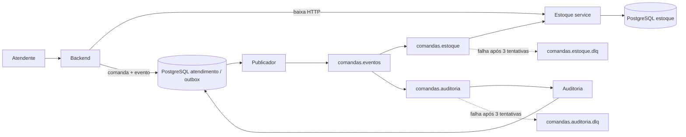
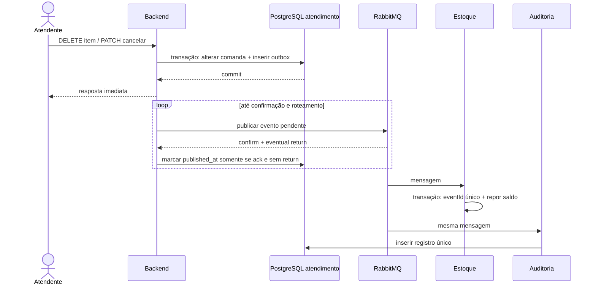

# Quarta entrega: estorno por eventos

## Antes e depois

Antes, `ComandaService` chamava `POST /api/estoques/movimentacoes/reposicoes` por HTTP dentro da operação de remover item ou cancelar comanda. A resposta ao atendente dependia da disponibilidade do estoque; uma resposta perdida podia deixar a comanda e o saldo divergentes. A baixa ao adicionar item já era HTTP síncrono.

Agora, remover item e cancelar comanda gravam o estado da comanda e um evento na mesma transação PostgreSQL. Um publicador lê a outbox a cada segundo e envia o JSON à exchange `comandas.eventos`. As filas `comandas.estoque` e `comandas.auditoria` recebem cópias independentes. O estoque estorna e registra o `eventId` na mesma transação; a auditoria armazena o evento e o expõe em `GET /api/eventos/comandas/{id}`. A baixa permanece síncrona para rejeitar saldo insuficiente imediatamente.





## Contrato e roteamento

O módulo Maven `eventos-contratos` define `ComandaEvento` e `Item`. O JSON inclui `eventId` (UUID), `eventType` (`ItemRemovido` ou `ComandaCancelada`), `occurredAt` (ISO 8601 UTC), `aggregateId` (ID da comanda) e `itens` (`itemId`, `produtoId`, `quantidade`). Não carrega entidades JPA. A remoção usa a chave `comanda.item.removido` e um item. O cancelamento usa `comanda.cancelada` e todos os itens ainda presentes; uma comanda vazia gera lista vazia para auditoria. Exemplo:

```json
{"eventId":"c3aa726e-8315-449b-8ff5-1c6aba7987a9","eventType":"ItemRemovido","occurredAt":"2026-09-23T20:00:00Z","aggregateId":42,"itens":[{"itemId":7,"produtoId":3,"quantidade":2}]}
```

As duas filas são duráveis e ligadas à exchange de tópico pela binding `comanda.#`; mensagens são persistentes. Cada fila possui sua própria DLQ. O publicador usa publisher confirms correlacionados e `mandatory` com publisher returns: sem confirmação, ou se a exchange não rotear, mantém a linha pendente. Várias instâncias podem selecionar registros diferentes com `FOR UPDATE SKIP LOCKED`. Uma falha após a confirmação e antes de marcar a outbox pode republicar a mensagem; `eventId` único em cada consumidor evita efeito duplicado. Uma fila na DLQ não bloqueia a outra.

## Consistência e limites

A resposta de remoção/cancelamento ocorre após o commit local. O saldo e a auditoria ficam eventualmente consistentes: normalmente chegam em segundos, mas podem atrasar enquanto o RabbitMQ ou um consumidor estiver indisponível. O endpoint de auditoria lista eventos **consumidos** pela fila de auditoria; não representa necessariamente todos os eventos ainda pendentes na outbox. A baixa HTTP ao adicionar item valida saldo de imediato, mas ainda não é uma transação distribuída com a comanda: falha do backend após a baixa pode exigir conciliação operacional. Esta entrega altera somente o estorno.

Eventos com falha de processamento são tentados três vezes e rejeitados sem requeue; RabbitMQ os encaminha à DLQ da fila correspondente. Inspecione payload, erro e cabeçalhos na UI de gerenciamento, corrija a causa e republique manualmente na exchange `comandas.eventos` com a chave original. Mantenha o mesmo `eventId` para que um reenvio seguro não duplique estoque ou auditoria. Para falha do broker na publicação, recupere o broker; a outbox retenta automaticamente. O custo é mais infraestrutura, atraso observável e necessidade de monitorar outbox e DLQs. O ganho é que remover e cancelar não dependem do estoque online e não perdem o evento se o processo cair após o commit.

## Demonstração em quatro cenários

1. **Fluxo normal:** defina saldo, adicione um item, remova o item; aguarde saldo original e consulte `GET /api/eventos/comandas/{id}` para `ItemRemovido`.
2. **Cancelamento:** adicione dois itens e cancele; confira retorno HTTP imediato, depois ambos os saldos e o evento `ComandaCancelada` com os dois `itemId`.
3. **Broker indisponível:** pare `rabbitmq`, remova um item, confirme que a operação concluiu e a outbox está pendente; reinicie o broker e observe saldo e auditoria convergirem.
4. **Falha definitiva:** publique um evento válido com `produtoId` inexistente na chave `comanda.item.removido`; após três tentativas, inspecione `comandas.estoque.dlq`. A fila de auditoria registra o mesmo evento. Cadastre o saldo e republique a mensagem da DLQ com o mesmo `eventId`.

O script `scripts/validar-integracao.ps1` automatiza baixa, cancelamento, espera pelo estorno e consulta de auditoria. `scripts/validar-recuperacao.ps1` para e reinicia o RabbitMQ deste Compose e confirma a publicação após a recuperação. `scripts/validar-dlq.ps1` publica um evento de demonstração inválido e confere a DLQ e a auditoria; passe as credenciais do broker por parâmetro ou pelas variáveis `RABBITMQ_USER` e `RABBITMQ_PASSWORD`. Para acompanhar pendências: `select event_id, routing_key, occurred_at from eventos_outbox where published_at is null;`. Para consultar duplicações: `select * from eventos_processados;` no banco do estoque.
