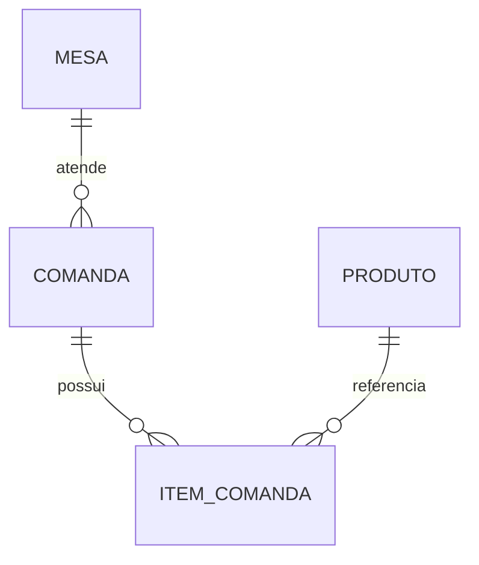

# Persistência

O backend usa PostgreSQL 17, Spring Data JPA, Flyway e Hibernate Envers. O esquema é criado exclusivamente por `backend/src/main/resources/db/migration/V1__criar_schema.sql`; Hibernate apenas o valida na inicialização.



| Entidade | Relações e restrições |
| --- | --- |
| Mesa | `numero` único e positivo; uma única comanda `ABERTA` por vez. |
| Produto | preço positivo, categoria e disponibilidade. |
| Comanda | pertence a uma mesa; itens são removidos por orphan removal. |
| ItemComanda | mantém preço unitário do momento do lançamento. |

As relações são LAZY. Consultas de comandas carregam mesa com `EntityGraph` e coleções por lote para evitar N+1. Operações de comanda são transacionais.

## Banco local

```bash
cp .env.example .env
docker compose up -d
set -a; source .env; set +a
cd backend && ./mvnw spring-boot:run
```

## Consultas

- `GET /api/produtos/pesquisa?nome=&categoria=&disponivel=&page=0&size=20&sort=nome,asc`
- `GET /api/comandas/pesquisa?status=&page=0&size=20&sort=abertaEm,desc`
- `GET /api/historico/PRODUTO/{id}`; substitua por `MESA`, `COMANDA` ou `ITEM_COMANDA` conforme necessário.

As pesquisas retornam `conteudo`, `pagina`, `tamanho`, `totalElementos` e `totalPaginas`. O histórico contém snapshots anterior/posterior, operação e instante da revisão. O responsável é nulo até a aplicação ter autenticação.

## Testes

Os testes usam PostgreSQL descartável do Testcontainers e executam a mesma migração Flyway. Rode `./mvnw test`; o teste de aceite de histórico usa a tag `persistence-eval`.
